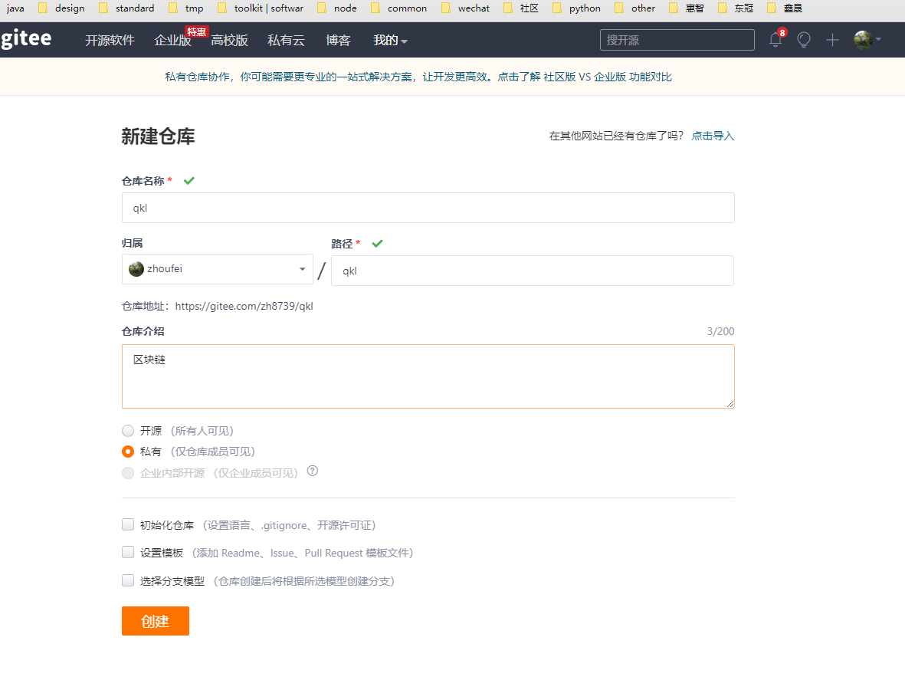
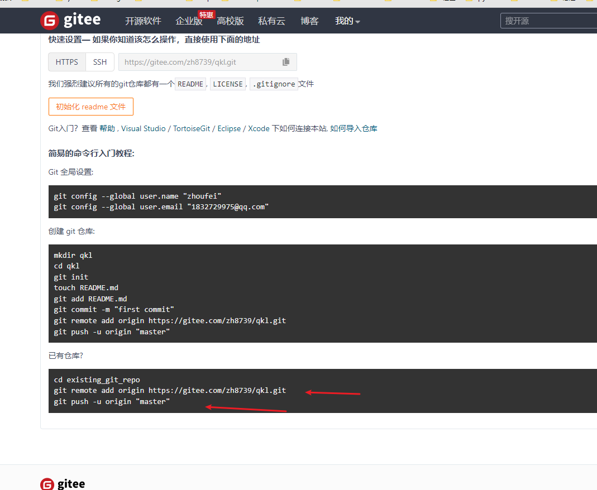
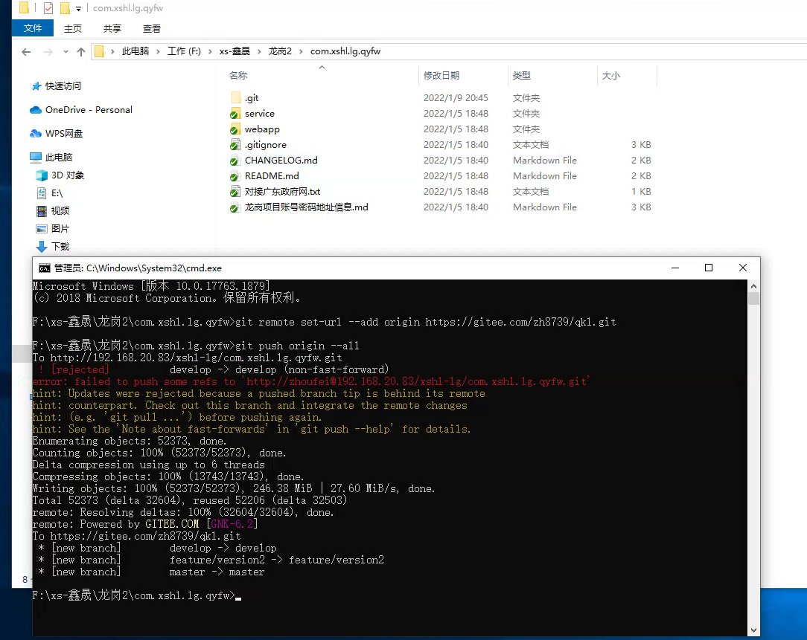
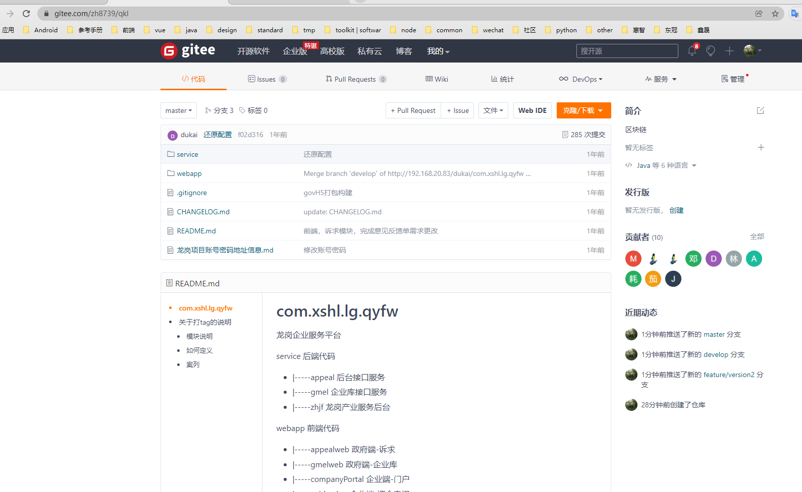

登录码云 

https://gitee.com/

之后新建仓库


输入仓库信息



点击创建

创建成功了之后会有下面这个界面



拷贝第一个箭头的那个, 拷贝仓库地址 `https://gitee.com/zh8739/qkl.git`

然后回到项目中（我们公司的项目）执行命令

```shell
git remote set-url --add origin https://gitee.com/zh8739/qkl.git

git push origin --all
```




之后我们再刷新我们的码云仓库就有了

