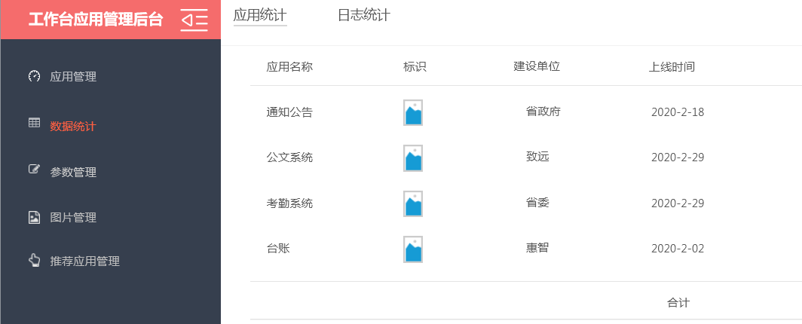
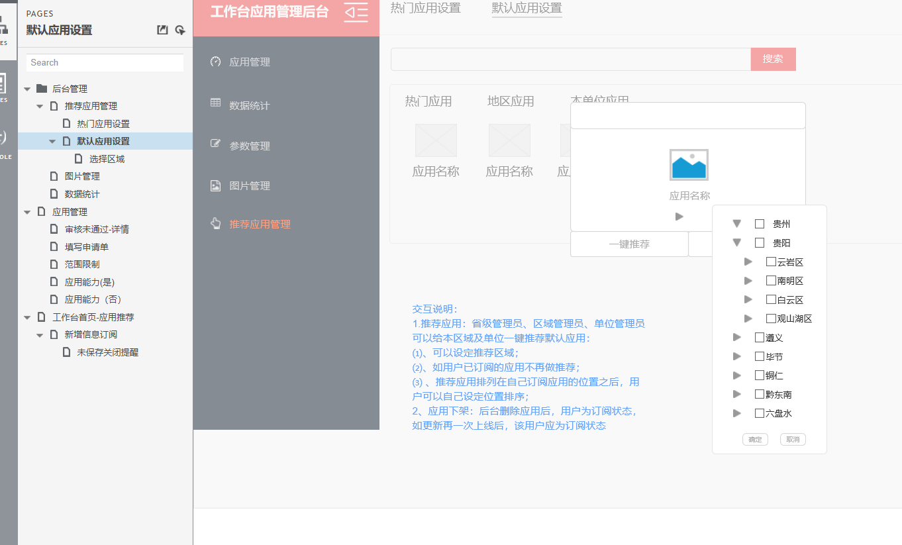

## 工作台所需接口

### 天气图片管理

1. 新增节点
   - 用户已经选择了的时间段接口（每天的和固定时间的，固定时间的就返回当前时间之后的时间）、这个可以为一个接口或者写成两个接口
   - 新增节点保存接口
2. 查看节点详情接口
3. 编辑节点接口
4. 删除节点接口
5. 用户已有节点列表接口，要分页

5. 用户端天气图片查询接口，根据当前的时间返回所需要的天气图片详细信息

### 数据统计

1. 应用统计列表接口

   

### 用户端收藏

> 由于有了顶置功能，后端返回相应的列表也应该有所变化，顶置的在最前面

1. 收藏顶置接口
2. 收藏取消顶置接口

### 推荐应用管理

> 接口暂时没有想好用什么

