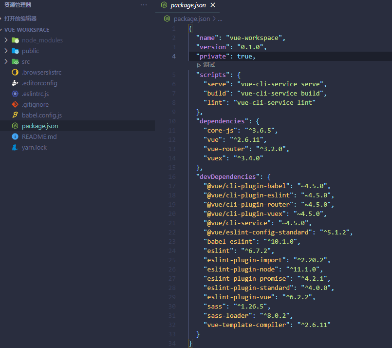
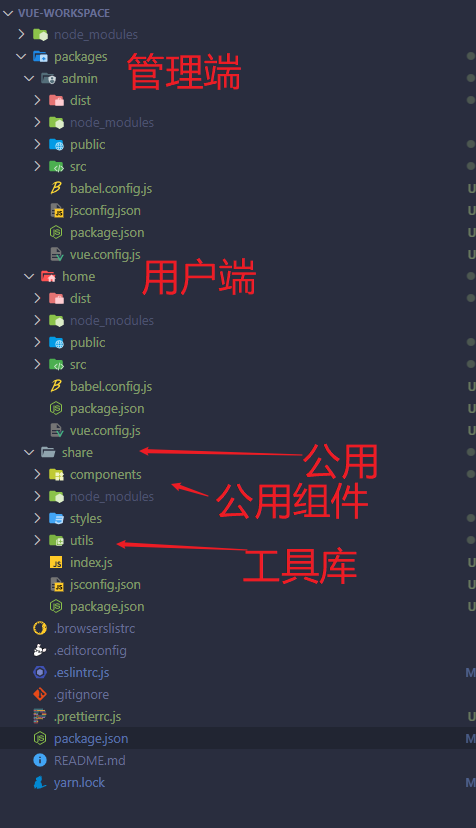

# vue 和 yarn  workspaces 结合搭建vue项目

## 背景

在一个项目中， 一般分用户端和管理端，又细分PC、H5，各个端很多东西是公用的， 比如配置文件，依赖库，工具库，而我们一般的做法就是搭建很多个项目，配置就拷贝，但这样很容易数据出错，拷贝漏掉了一些，还有就是把一些公用的组件封装好， 通过npm发布，但是这样还麻烦，在开发环境中会出现频繁更新，每次更新都要发布版本，还有到各个项目中升级版本


## 使用 yarn workspaces


`yarn workspaces`就是使用工作空间，专业的术语就叫 **`monorepo(monolithic repository)`**就是一种项目管理方式， 可以使用 `yarn` `lerna` `pnpm`来实现， 我们公司目前使用的是`yarn`， 目前很多项目都是使用这种项目管理方式， 像vue、react， babel这些的源码都是使用这种方式来管理的

react https://github1s.com/facebook/react


### 创建工作空间

要创建一个工作空间，我们只需在`package.json`里面添

```json
  "private": true,
  "workspaces": [
    "packages/*"
  ],
```

要private为true时workspace才会被启用，workspaces属性的值为一个字符串数组，每一项指代一个workspace路径，支持全局匹配，这里的路径指向指的是package.json所在文件夹文件夹名。

我们工作空间的目录就是下面这个样子了

```shell
|--node_modules
|--packages
  |--workspace-home  # 工作空间workspace-home
     |--src 
     |--package.json #独有的依赖，我们就可以单独安装在这个里面
  |--workspace-admin
  	 |--src   #我们这里可以引用share模块的， 由于定义的名字叫 @project/share， 我们引入的时候就像这样 import { xxxx } from '@project/share'
     |--package.json 
  |--share
     |--package.json #在package.json里面要定义name属性，比如这个叫 @project/share
|--package.json  #公用的依赖，我们就可以安装在这个里面
```

注意， 工作空间中（packages）`package.json`我们要添加`name`属性，这就是工作空间的名字，而不是文件夹名


大概了解了这些知识，我们就可以在vue项目中使用这种方式，用户PC端的放在一个工作空间中，后端管理PC端放在另一个工作空间中，我们就可以把公用的配置文件，组件，工具库放到一个工作空间中，在另个两个工作空间中引用

**工作空间命令**

```shell
#能够共享的包就安装到根
#工作空间独立的就单独安装到工作区
#添加到根
yarn add cross-env -D -W
#删除根
yarn remove cross-env  -W

#如果想单独添加或者移除某个子项目的依赖，可以使用如下命令：
yarn workspace <workspace_name > add <pkg_name> --dev
yarn workspace <workspace_name > remove <pkg_name>

#注意： workspace_name workspace_name 包名，package.json 中设置的 name，不是文件夹名

#比如
yarn workspace @project/home add  swiper
yarn workspace @project/admin add  swiper

yarn workspace @project/home add react-custom-scrollbars
```


### 在vue项目中搭建

比如现在我们要搭建一个项目，总共有两个端，管理端和用户端，项目名叫 `vue-workspace`

#### 创建项目

使用 ` vue create vue-workspace` 创建一个项目，选择项目配置，搭建好的项目大致如下


#### 改造项目

新建一个 `packages`的目录，这个目录下方新建三个文件夹`admin`, `home`, `share`

把项目根目录的`src`、`public`,`babel.config.js`,分别拷贝到 `packages/amin`和`packages/home`文件下，分别在两个文件夹中创建`package.json`

目录结构

  ```shell
  /vue-workspace
    |--packages
       |--admin 后台：管理端
       	|--public
          |--src
          |--babel.config.js
          |--package.json
       |--home 门户：用户端
          |--public
       	|--src
          |--babel.config.js
          |--package.json
       |--share 放公用的代码
       	|--index.js
          |--package.json
    |--package.json
  ```

 把根目录的 `@vue/cli-service` 依赖和`scripts`拷贝过来，定义工作空间的名字

> 为什么要拷贝 `@vue/cli-service`，这样我们就能直接在 packages/admin文件夹下执行`npm run dev`这些命令，而不会出现`vue-cli-service`不存在的报错

  `amin/package.json` *注意我多添加了一个`dev`的命令， 习惯` npm run dev`运行*

  ```json
  {
    "name": "@project/admin",
    "version": "0.1.0",
    "scripts": {
      "serve": "vue-cli-service serve",
      "dev": "vue-cli-service serve",
      "build": "vue-cli-service build",
      "lint": "vue-cli-service lint"
    },
    "devDependencies": {
      "@vue/cli-service": "~4.5.0"
    }
  }
  ```

  `home/package.json `  *注意我多添加了一个`dev`的命令， 习惯` npm run dev`运行*

  ```json
  {
    "name": "@project/home",
    "version": "0.1.0",
    "scripts": {
      "serve": "vue-cli-service serve",
      "dev": "vue-cli-service serve",
      "build": "vue-cli-service build",
      "lint": "vue-cli-service lint"
    },
    "devDependencies": {
      "@vue/cli-service": "~4.5.0"
    }
  }
  ```

  `share/package.json`

```json
{
  "name": "@project/share",
  "version": "0.1.0",
  "main": "index.js",
  "scripts": {
    "build": "echo 没有打包",
    "lint": "vue-cli-service lint"
  },
  "devDependencies": {
    "@vue/cli-service": "~4.5.0"
  }
}
```


修改项目根目录下的`package.json`， 添加`workspaces`，修改 `scripts`

```json
 "private": true,
  "workspaces": [
    "packages/*"
  ],
  "scripts": {
    "lint": "yarn workspaces run lint",
    "build": "yarn workspaces run build",
    "dev:admin": "yarn --cwd packages/admin dev",
    "build:admin": "yarn --cwd packages/admin build",
    "dev:home": "yarn --cwd packages/home dev",
    "build:home": "yarn --cwd packages/home build"
  },
```

`yarn --cwd` 可以指定工作目录 `yarn --cwd packages/admin dev` 就是相当于在 `packages/admin`目录下执行 `npm run dev`

到这一步， 我们在根目录下执行安装依赖，这样工作空间`@project/admin`和`@project/home`的依赖能安装上

```shell
yarn install
```

这样 `yarn dev:admin`就运行管理端， `yarn dev:home`运行用户端

大致目录结构如下， 这样在管理端`admin`中，就可以通过，就能很方便的修改了

```js
// 引入公用样式
import "@project/share/styles/index.scss"

// 引入组件、工具库等
import { formatDate } from "@project/share"
```





### 问题

如遇到公用的`share`没有解析正确，或者需要自己解析时，要配置`vue.config.js`

```js
// vue.config.js
const path = require("path")

function resolve(dir) {
  return path.join(__dirname, dir)
}

/**
 * @type {import('@vue/cli-service').ProjectOptions}
 */
module.exports = {
  publicPath: process.env.NODE_ENV === "development" ? "/" : "./", // 部署应用包时的基本 URL
  assetsDir: "static",
  devServer: {},
  chainWebpack: (config) => {
    // 解析 share--如遇到 share 不能被解析时可以用
    // config.module.rule("js").include.add(resolve("../share")).add(resolve("src"))
    // config.module.rule("vue").include.add(resolve("../share")).add(resolve("src"))
  },
}
```


