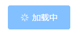
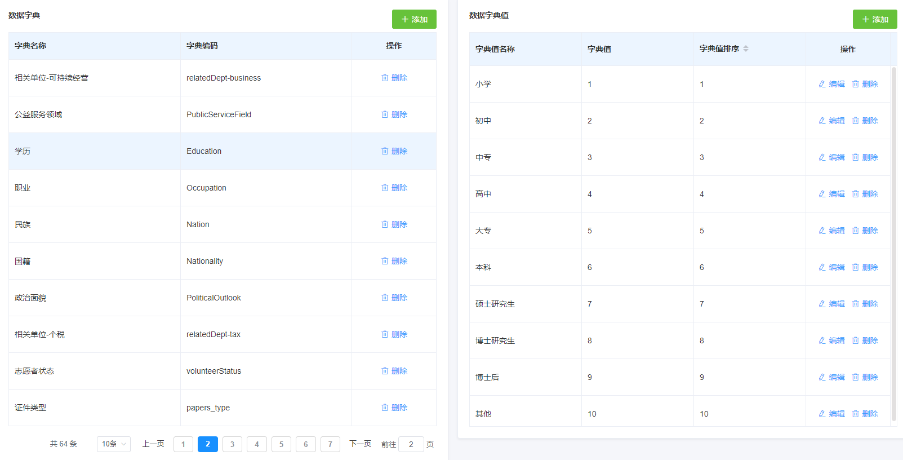
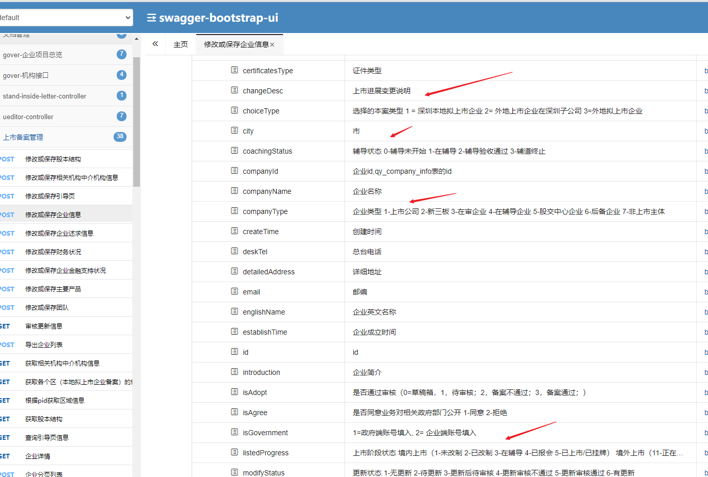
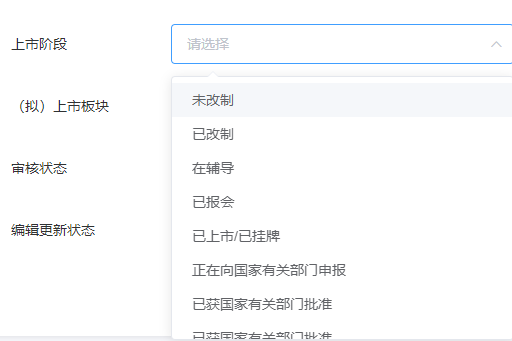
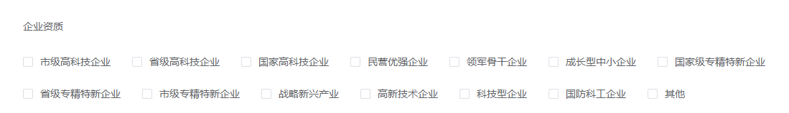
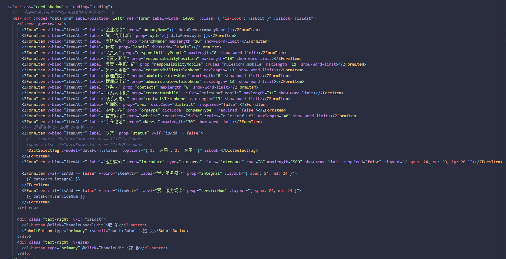
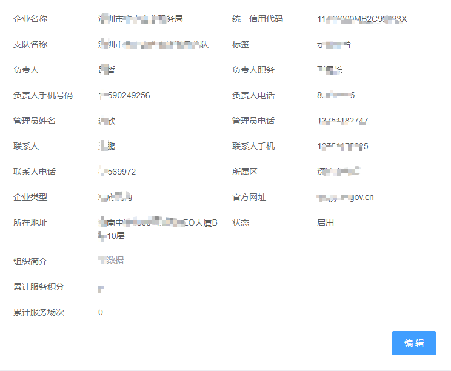
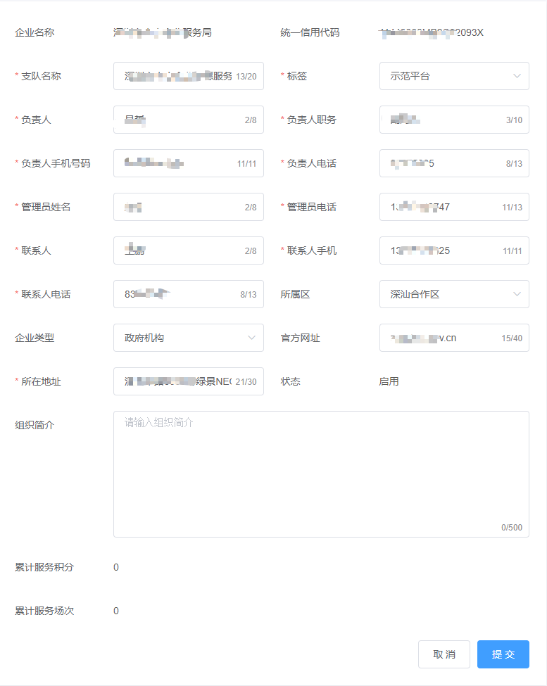

# 关于前端开发中常用组件封装的一些思考、技巧

> 本环境说明是针对 vue+element-ui 讲解的，在 react 中也很实用， 我主要讲解的是一个思路

我们就从一个后台项目讲解开始

**注意**：*在vue中组件封装、我们要熟悉父子组件的传值方式$attrs和$listeners，以及vue的render写法，jsx，有很多必须要用jsx，用模板实现起来太麻烦*


## 提交按钮

我们在提交的时候， 为了防止重复提交， 很多是用防抖或者节流， 但是这样不好， 但网络很慢的时候， 还是会出现重复提交， 还有就是没有状态，就用户不知道怎么到底提交了没，都没有一个状态

我们要做的应该是给按钮添加一个加载状态，当点击的时候，在提交中有一个`loading`状态，`el-button` 自带的就有一个 `loading`属性



我们传参的时候， 传递一个 `submit`提交函数，是一个`Promise`，但`promise`状态改变的时候我们就把 `loading`状态修改为`false`

#### 封装代码

```vue
<template>
  <el-button v-bind="$attrs" :loading="loading" @click="click">
    <slot></slot>
  </el-button>
</template>

<script>
export default {
  name: "SubmitButton",
  props: {
    // 提交函数、
    submit: {
      type: Function,
      require: true,
    },
  },
  data() {
    return {
      loading: false,
    };
  },

  methods: {
    async click() {
      try {
        this.loading = true;
        await this.submit();
      } finally {
        this.loading = false;
      }
    },
  },
};
</script>
```

#### 使用

我们在页面中使用

```html
<el-form ref="form" :model="dataForm" :rules="rules">
  <el-form-item label="用户名" prop="username">
    <el-input placeholder="请输入用户名" v-model="dataForm.username"></el-input>
  </el-form-item>
  <el-form-item>
    <SubmitButton type="primary" :submit="formSubmit">提 交</SubmitButton>
  </el-form-item>
</el-form>
```

```js
export default {
  data() {
    return {
      dataForm: {
        username: "",
      },
      rules: {
        username: [
          {
            required: true,
            message: "请输入用户名",
          }
        ]
      }
    }
  },
  methods: {
    validate() {
      return this.$refs.form.validate();
    },
    async formSubmit() {
      // 表单验证
      await this.validate();
      // 提交表单数据
      await this.$http.post('/api/xxxx', this.dataForm)
      this.$message.success('提交成功！')
      this.$router.back()
    },
  },
};
```

## 对话框、抽屉

> 一般是一个关闭按钮， 一个确定按钮，点击确定按钮的时候要去调用接口

点击关闭按钮我们直接关闭，点击确定按钮是， 参照 提交按钮，其实我们的对话框、抽屉这些， 都是在传入一个提交函数``submit`，这个函数返回一个 `Promise`

- 当从pending状态变为reslove时，我们就关闭对话框，
- 当从pending状态变为reject时，就提交的时候报错了什么的， 我们不要关闭对话框

对话框代码如下，抽屉和对话框差不多的

#### 封装代码

```vue
<template>
  <el-dialog v-bind="$attrs">
    <template v-if="$slots.title">
      <slot name="title" slot="title"></slot>
    </template>
	<slot></slot>
    <template slot="footer">
      <el-button @click="close">取 消</el-button>
      <SubmitButton type="primary" :submit="btnSubmit">确 定</SubmitButton>
    </template>
  </el-dialog>
</template>

<script>
import SubmitButton from "@/components/SubmitButton"
export default {
  name: "Dialog",
  components: { SubmitButton },
  props: {
    submit: Function
  },
  methods: {
    close() {
      this.$emit("update:visible", false)
    },
    async btnSubmit() {
      await this.submit()
      this.close()
    },
  },
}
</script>
```

#### 使用

```html
<Dialog :visible.sync="visible" :submit="dialogSubmit">
     <h3 slot="title">删除提示</h3>
     你确定删除这个用户吗？
</Dialog>
```

```js
export default {
  methods: {
     async dialogSubmit() {
       // 删除操作
       await this.$http.post('/api/xxxx?id=xxxxx')
       this.$message.success("删除成功！")
    }
  }
}
```


## 数据字典

> 数据字典就是对存储值的描述，比如用1表示男，0表示女、而我们传给后端的数据就传0和1， 后端返回的时候也只返回0和1、我们要根据0和1去匹配男女
>
> 如果是多选的话， 我们一般都是以逗号拼接，例如这样传 1,3,5

### 两种数据字典

- **后台配置的数据字典**：一般我们要根据数据字典的code获取数据字典选项值，比如有一个选择学历的下拉菜单，我们就要通过下面的这个字典编码`Education`去查询选项值，之后把拿到的数据渲染出来

****

- **前端界面写死的数据字典**：列如


### 封装

我们传给后端的的是数据字典的值，后端返回的时候也是返回的数据字典的值，查看详情的时候我们也需要根据数据字典的值去匹配，拿到文本

我们先思考想怎么用，封装一个组件叫 `DictSelectTag` ， 用 `label`显示文字、`value`表示关联的值

##### 根据数据字典code获取数据字典项options

```js
const promiseCache = new Map()
/**
 * 根据数据字典code获取数据字典项options
 */
function byDictCodeGetOptions(dictCode) {
   const key = 'dict_' + dictCode
   let promise = promiseCache.get(key)
   // 当前promise缓存中没有 该promise
   if (!promise) {
       promise = request.get('/api/dict/' + dictCode).then(
           ({ data }) => {
               return data.map(item => {
                   item.value = item.itemValue
                   item.label = item.itemName
                   return item
               })
           },
           error => {
               // 在请求回来后，如果出现问题，把promise从cache中删除 以避免第二次请求继续出错S
               promiseCache.delete(key)
               return Promise.reject(error)
           }
       )
       promiseCache.set(key, promise)
   }
    // 返回promise
  return promise
}
```

另外就是针对前端页面写死的，我们想的是传一个 `options`过去，想传的类型是如下这样

```js
/** [{value: '禁用', label: '禁用' }, '启用'] */
/** 这种格式 { 1:'禁用', 2: '启用' } */
/** 这种格式 { 1:'禁用', 2: {label: '启用', value: 2} } */
/** 这种格式 { 1:'禁用', 2: {label: '启用'} } */
```

##### 根据用户传入的options得到我们想要的options

根据用户传的`options`得到我们需要的`options`,我们还可以通过传入`props`, 通过 `props.label`指定文字 `key`, `props.value` 指定`value`的可以

```js
/**
 * 根据options获取完整的options
 * @param {*} options
 * @param {*} props
 * @returns
 */
export function getDictOptions(options, props) {
  if (!options) {
    return []
  }
  const labelKey = (props && props.label) || "label"
  const valueKey = (props && props.value) || "value"
  /** [{value: '禁用', label: '禁用' }, '启用'] */
  if (Array.isArray(options)) {
    return options.map((item) => {
      if (typeof item === "string") {
        return { value: item, label: item }
      }
      // object
      return {
        ...item,
        label: item[labelKey],
        value: item[valueKey],
      }
    })
  } else if (typeof options === "object") {
    /** 这种格式 { 1:'禁用', 2: '启用' } */
    /** 这种格式 { 1:'禁用', 2: {label: '启用', value: 2} } */
    /** 这种格式 { 1:'禁用', 2: {label: '启用'} } */

    return Object.keys(options).map((key) => {
      const item = options[key]
      if (typeof item == "string") {
        return { value: key, label: item }
      }
      // object
      return {
        ...item,
        label: item[labelKey],
        value: item[valueKey] || key,
      }
    })
  } else {
    throw new TypeError("传入类型不对")
  }
}
```

##### 组件代码

我们封装的组件要分为查看状态和编辑状态，编辑状态常有的组件用 `radio`,`checkbox`,`select`，还有一个 `radioButton`，不过这个用的很少

`DictSelectTag.vue`

```html
<template>
  <!-- 查看状态 -->
  <span v-if="isLook">
    {{ getText() || empty }}
  </span>
  <el-radio-group v-bind="$attrs" v-else-if="tagType === 'radio'" v-on="listeners" :value="getValue" :disabled="disabled" :id="id">
    <el-radio v-for="(item, key) in dictOptions" :key="key" :label="item.value">{{ item.label }}</el-radio>
  </el-radio-group>

  <el-select
    v-bind="$attrs"
    :id="id"
    v-else-if="tagType === 'select'"
    :placeholder="placeholder"
    :disabled="disabled"
    :value="getValue"
    v-on="listeners"
  >
    <el-option v-for="(item, key) in dictOptions" :key="key" :value="item.value" :label="item.label"></el-option>
  </el-select>

  <el-checkbox-group
    v-bind="$attrs"
    :id="id"
    v-else-if="tagType === 'checkbox'"
    :placeholder="placeholder"
    :disabled="disabled"
    :value="getValue"
    v-on="listeners"
  >
    <el-checkbox v-for="(item, key) in dictOptions" :key="key" :label="item.value">{{ item.label }}</el-checkbox>
</template>
```

`DictSelectTag.vue`

```js
import { getDictOptions, isEmpty, byDictCodeGetOptions } from "@/utils"
export default {
  name: "DictSelectTag",
  props: {
    /**
     * 字典数据、没有的话就使用code去查询
     * @type { Array<{ label:string, value: string | number }> | Object<[value]: string> }
     */
    options: [Array, Object],
    /** 字典 code  */
    dictCode: {
      type: String,
    },
    value: [String, Number, Array],
    /** 类型 */
    type: {
      type: String,
      default: "select",
      validator: (val) => {
        return ["radio", "select", "radio", "checkbox"].indexOf(val) !== -1
      },
    },
    /** 值是以逗号分割 */
    commaSplit: Boolean,

    /** 知道 label,和 value 的 key { label: 'labelK', value: 'value'  } */
    props: Object,
    /** 是否是查看 */
    isLook: Boolean,
    /** 数据为空时显示什么 */
    empty: {
      // type: String,
      default: "-",
    },
    /** 分割字符串,分割符，多个值的时候查看时以什么分割 */
    separator: {
      type: String,
      default: " / ",
    },

    placeholder: String,
    disabled: Boolean,
    id: String,
  },
  data() {
    return {
      dictOptions: [],
    }
  },
  computed: {
    tagType() {
      return this.type
    },
    getValue() {
      if (this.commaSplit) {
        if (this.value) return this.value.split(",")
        return []
      }
      return this.value != null ? this.value.toString() : undefined
    },
    listeners() {
      return {
        ...this.$listeners,
        input: this.onInput,
      }
    },
  },
  watch: {
    dictCode: {
      immediate: true,
      handler() {
        this.initDictData()
      },
    },
    options: "initDictData",
  },
  methods: {
    initDictData() {
      if (this.options) {
        this.dictOptions = getDictOptions(this.options, this.props)
      } else {
        byDictCodeGetOptions(this.dictCode).then((result) => (this.dictOptions = Object.freeze(result)))
      }
    },
    onInput(val) {
      if (this.commaSplit && Array.isArray(val)) {
        val = val.join(",")
      }
      this.$emit("input", val)
    },

    // 查看的时候
    getText() {
      const { dictOptions } = this
      const valueArr = isEmpty(this.value) ? [] : String(this.value).split(",")

      return valueArr
        .map((value) => {
          const find = dictOptions.find((item) => item.value == value)
          return (find && find.label) || value
        })
        .join(this.separator)
    },
  },
}
```


### 使用

```html
  <el-form-item label="上市阶段">
              <dict-select-tag
                v-model="dataForm.listedProgress"
                multiple
                collapse-tags
                dict-code="record_listed_stage"
                clearable
                @change="handleSearch"
              ></dict-select-tag>
            </el-form-item>

 <el-form-item label="备案类型">
              <dict-select-tag
                dictCode="-"
                multiple
                collapse-tags
                :options="recordTypeOptions"
                v-model="dataForm.choiceType"
                clearable
                @change="handleSearch"
              ></dict-select-tag>
</el-form-item>


```




```html
<el-form-item label="企业资质" prop="aptitude" width="200">
    <dict-select-tag
                     type="checkbox"
                     dictCode="governmentIdentification"
                     v-model="dataForm.aptitude"
                     :isLook="isLook"
                     ></dict-select-tag>

        </el-form-item>
```




## 限制输入框封装

> 很多输入限制，比如只能输入数字，只能输入小数


### 使用

```html	
<!--- 只能输入 正整数 --->
<InputLimit inputLimit="number" v-model="age" placeholder="请输入年龄"></InputLimit>

<!--- 只能输入 小数、包含正整数、开头只能为一个零 --->
<InputLimit inputLimit="decimal" v-model="money" placeholder="请输入金额"></InputLimit>

<!-- 7位整数4位小数 -->
<InputLimit :inputLimit="/^(0|[1-9]\d{0,6})(\.\d{0,4})?$/" v-model="investMoney" placeholder="请输入">
	<template slot="suffix">万元</template>
</InputLimit>
```

### 代码

`@/utils/index.js`

```js
const _toString = Object.prototype.toString

export function isRegExp(v) {
  return _toString.call(v) === "[object RegExp]"
}

/** 正整数 */
export const intergerRE = /^\d*$/

/** 小数、包含正整数、开头只能为一个零 */
export const decimalRE = /^(0|[1-9]\d*)(\.\d*)?$/
```

```js
import { isRegExp, decimalRE, intergerRE } from "@/utils"

const limitList = [
  /* 小数、包含正整数、开头只能为一个零 */
  { name: "decimal", regexp: decimalRE },
  /* 正整数 */
  { name: "number", regexp: intergerRE },
]

let timer
export default {
  name: 'ElInputLimit',
  props: {
    value: {
      type: [String, Number],
    },
    // 输入限制、 decimal | number
    // 优先顺序，RegExp ==> limitList
    inputLimit: {
      type: [String, RegExp],
      validator: function (val) {
        if (val) {
          if (isRegExp(val)) {
            return true
          }
          return !!limitList.find(item => item.name === val)
        } else {
          return true
        }
      },
    },

    // el-tooltip 的 props，如果传字符串就是 传 content
    tooltip: {
      type: [String, Object],
    },
  },
  data() {
    return {
      showValue: this.value,
      vRegexp: '',
      tooltipVisible: false,

      tooltipProps: {},
    }
  },

  watch: {
    value(val) {
      this.showValue = val
    },
    inputLimit: 'setRegexp',

    tooltip: {
      immediate: true,
      handler(val) {
        const options = typeof val === 'string' ? { content: val } : val

        this.tooltipProps = {
          effect: 'light',
          content: '不能输入该字符',
          placement: 'bottom',
          ...options,
        }
      },
    },
  },

  created() {
    this.setRegexp()
  },

  methods: {
    setRegexp() {
      const { inputLimit } = this
      if (!inputLimit) {
        this.vRegexp = ''
        return
      }
      if (isRegExp(inputLimit)) {
        this.vRegexp = inputLimit
        return
      }
      if (inputLimit) {
        const limit = limitList.find(item => item.name === inputLimit)
        if (limit) {
          this.vRegexp = limit.regexp
        } else {
          this.vRegexp = ''
        }
      }
    },

    onInput(val) {
      clearTimeout(timer)
      if (val !== undefined && val !== '') {
        const re = this.vRegexp
        if (re) {
          // 输入不合法（不在规则内）的字符
          if (!re.test(val)) {
            this.tooltipVisible = true

            timer = setTimeout(() => {
              this.tooltipVisible = false
            }, 2000)

            return
          }
        }
      }
      this.tooltipVisible = false
      this.$emit('input', val)
    },

    onBlur(event) {
      this.tooltipVisible = false
      this.$emit('blur', event)
    },
  },
  render() {
    return (
      <el-tooltip value={this.tooltipVisible} manual {...{ props: this.tooltipProps }}>
        <el-input
          value={this.showValue}
          // 传递 attrs，解决 el-input 有部分收集的是 $attrs
          {...{ props: this.$attrs, attrs: this.$attrs, on: { ...this.$listeners, input: this.onInput, blur: this.onBlur } }}
        >
          {Object.entries(this.$slots).map(([name, slot]) => (
            <template slot={name}>{slot}</template>
          ))}
        </el-input>
      </el-tooltip>
    )
  },
}
```


## 表单封装

> 后台管理项目中，想一般表单有编辑模式和查看模式，大体上查看模式和编辑模式是一样的布局

我们使用element-ui 的表单，都知道表单写着很麻烦，大体里面就是Input输入框，Select 选择器，单选框，多选框，时间选择器这些，但每一次要写一个 el-from-item，需要指定label，prop, 而里面的具体控件还要绑定，写 placeholder，写rules

可能表单要考虑响应式布局，那么 el-from-item  还需要 el-col 包裹

先看看我封装的在项目中使用的效果吧

### 效果预览

#### 使用代码



##### 对应页面查看状态

能支持响应式的，缩小的时候字段单独一行



##### 对应页面编辑状态




### 封装代码

`FormItem`

```js
import { formatDate, getValueByPath, isEmpty, setValueByPath } from '@/utils'
export default {
  name: 'ZFormItem',
  inheritAttrs: false,
  props: {
    // 可以手动传 model 值，否则使用 el-form 上面的 model
    model: Object,
    // el-form-item 的 label
    label: String,
    // 关联的值、和 el-form-item 的 prop 一样， 可以这样传 'a.b.c'
    prop: String,
    // el-form-item 的rules
    rules: [Object, Array],
    // 是否必填
    required: Boolean,
    labelWidth: [String, Number],

    // 类型, 默认值： 有dictCode和options时默认为select，否则为text(input)
    type: {
      type: String,
      validator: val => {
        return ['text', 'textarea', 'radio', 'checkbox', 'select', 'date'].indexOf(val) !== -1
      },
    },

    // 字典code,如果有字典code, 就是用dict-select-tag
    dictCode: String,
    options: [Array, Object],

    placeholder: String,

    // 数据未空时显示什么， 可传 vnode
    empty: {
      // default: '',
    },

    // layout 布局
    layout: [Number, Object], // el-row span 值、如果使用了 Object, 那么就绑定
    // layout :{ span:12, xs: 24: lg: 12 }

    // 单位-我这个比较特殊（万元、人）
    unit: {},

    // 时间输入框的 type
    dateType: {
      type: String,
    },
  },

  computed: {
    tagType() {
      if (!this.type) {
        if (this.options || this.dictCode) {
          return 'select'
        } else {
          return 'text'
        }
      } else {
        return this.type
      }
    },
    form() {
      if (this.model) return {}
      let parent = this.$parent
      let parentName = parent.$options.componentName
      while (parentName !== 'ElForm') {
        parent = parent.$parent
        parentName = parent.$options.componentName
      }
      return parent
    },
    isEdit() {
      if (this.form) {
        return !this.form.$attrs?.isLook
      }
      return true
    },
    dataForm() {
      if (this.model) {
        return this.model
      }
      return this.form.model || {}
    },
    realValue: {
      get() {
        // return this.dataForm[this.prop]
        return getValueByPath(this.dataForm, this.prop)
      },
      set(val) {
        // this.model[this.prop] = val
        // this.$set(this.dataForm, this.prop, val)
        setValueByPath(this.dataForm, this.prop, val, true)
      },
    },
    showPlaceholder() {
      if (this.placeholder) {
        return this.placeholder
      }
      if (this.tagType === 'text' || this.tagType === 'textarea') {
        return '请输入' + this.label
      }
      return '请选择' + this.label
    },
  },
  methods: {
    isEmpty,
    renderFormInner() {
      const { dictCode, options, isEdit } = this
      // 数据字典
      if (dictCode || options) {
        return <dict-select-tag {...{ props: this.$attrs, on: this.$listeners }} dict-code={dictCode} options={options} v-model={this.realValue} type={this.tagType} is-look={!isEdit}></dict-select-tag>
      }
      if (this.tagType === 'date') {
        if (this.dateType?.includes('range')) {
          const formats = {
            daterange: 'yyyy-MM-dd',
            datetimerange: 'yyyy-MM-dd HH:mm',
          }

          const format = this.$attrs.format || formats[this.dateType]

          if (isEdit) {
            return <DateRangePicker {...{ props: this.$attrs, on: this.$listeners }} type={this.dateType} value-format="timestamp"></DateRangePicker>
          }
          return (
            <span>
              {formatDate(this.$attrs.startTime, format)} 至 {formatDate(this.$attrs.endTime, format)}
            </span>
          )
        }
        if (isEdit) {
          return <el-date-picker v-model={this.realValue} {...{ props: this.$attrs, on: this.$listeners }} value-format="timestamp" type={this.dateType || 'date'} placeholder="选择日期"></el-date-picker>
        }
        return <span>{formatDate(this.realValue, this.$attrs.format)}</span>
      }
      // 编辑
      if (this.isEdit) {
        // 输入框 input
        return (
          <ElInputLimit {...{ props: this.$attrs, attrs: this.$attrs, on: this.$listeners }} type={this.tagType} v-model={this.realValue} placeholder={this.showPlaceholder}>
            {
              //  this.$slots.suffix && <span slot="suffix">{this.$slots.suffix}</span>
              this.unit && (
                <span slot="suffix" class="unit suffix">
                  {this.unit}
                </span>
              )
            }
          </ElInputLimit>
        )
      } else {
        // 输入框 input
        return <span>{this.isEmpty(this.realValue) ? this.empty : this.realValue + (this.unit || '')}</span>
      }
    },

    getRules() {
      if (!this.isEdit) {
        return undefined
      }
      let rules
      if (this.required) {
        if (this.tagType === 'text' || this.tagType === 'textarea') {
          rules = {
            message: '请输入' + this.label,
            required: true,
            trigger: 'blur',
          }
        } else {
          rules = {
            message: '请选择' + this.label,
            required: true,
            trigger: ['change'],
          }
        }
      }

      if (this.rules) {
        if (rules) {
          if (Array.isArray(this.rules)) {
            rules = [rules, ...this.rules]
          } else {
            rules = [rules, this.rules]
          }
        } else {
          rules = this.rules
        }
      }
      return rules
    },

    renderFormItem() {
      const rules = this.getRules()
      return (
        <el-form-item label={this.label} prop={this.prop} rules={rules} labelWidth={this.labelWidth}>
          {this.$slots.default ? this.$slots.default : this.renderFormInner()}
        </el-form-item>
      )
    },
  },

  render(h) {
    const formItem = this.renderFormItem()
    if (typeof this.layout === 'object') {
      return h('el-col', { props: this.layout }, [formItem])
    } else if (this.layout) {
      return <el-col span={this.layout}>{formItem}</el-col>
    }
    return formItem
  },
}
```


工具库代码 `@/utils/prop`

```js
/**
 * 根据字段 key 获取值或设置值,参考element-ui源码，小部分调整
 */
import Vue from 'vue'
export function getValueByPath(object, prop) {
  prop = prop || ''
  const paths = prop.split('.')
  let current = object
  let result = null
  for (let i = 0, j = paths.length; i < j; i++) {
    const path = paths[i]
    if (!current) break

    if (i === j - 1) {
      result = current[path]
      break
    }
    current = current[path]
  }
  return result
}

export function setValueByPath(object, prop, val, isVueSet) {
  prop = prop || ''
  const paths = prop.split('.')
  let current = object
  for (let i = 0, j = paths.length; i < j; i++) {
    const path = paths[i]
    if (!current) break

    if (i === j - 1) {
      if (isVueSet) {
        Vue.set(current, path, val)
      } else {
        current[path] = val
      }
      break
    }
    current = current[path]
  }
}
```

时间格式化库 `@/utils/date`

```js
/**
 * 日期时间格式库
 * @author zhoufei
 */

function zeroize(n) {
  return Number(n) >= 10 ? n : "0" + n
}

/**
 * new Date
 * @param date
 */
function newDate(date = new Date()) {
  if (Object.prototype.toString.call(date) === "[object Date]") {
    return date
  } else if (Number(date)) {
    return new Date(Number(date))
  } else if (typeof date === "string") {
    // 在ios上必须要用 YYYY/MM/DD 的格式
    date = date.replace(new RegExp(/-/gm), "/")
    // 在ie浏览器中还必须补零 new Date('2020-01')可以， new Date('2020/1')不可以
    return new Date(date)
  } else {
    return new Date(date)
  }
}

function isEmpty(v) {
  return v === "" || v === undefined || v === null
}

/**
 * 按所给的时间格式输出指定的时间
 * @param {Date|Number|String} data
 * @param {string} format 格式化字符串
 * @return {string} 格式化的时间
 * @example formatDate(new Date(1409894060000), 'yyyy-MM-dd HH:mm:ss 星期w') ==> "2014-09-05 13:14:20 星期五"
 * 格式说明
  对于 2014.09.05 13:14:20
  yyyy: 年份，2014
  yy: 年份，14
  MM: 月份，补满两位，09
  M: 月份, 9
  dd: 日期，补满两位，05
  d: 日期, 5
  HH: 24制小时，补满两位，13
  H: 24制小时，13
  hh: 12制小时，补满两位，01
  h: 12制小时，1
  mm: 分钟，补满两位，14
  m: 分钟，14
  ss: 秒，补满两位，20
  s: 秒，20
*/
function formatDate(date, format = "yyyy/MM/dd HH:mm") {
  if (isEmpty(date)) return "-"
  if (date) var tmpDate = newDate(date)
  if (String(tmpDate) === "Invalid Date") return date
  date = tmpDate
  var y = date.getFullYear()
  var obj = {
    M: date.getMonth() + 1, // 0 ~ 11
    d: date.getDate(), // 1 ~ 31
    H: date.getHours(), // 0 ~ 23
    h: date.getHours() % 12,
    m: date.getMinutes(), // 0 ~ 59
    s: date.getSeconds(), // 0 ~ 59
    w: ["日", "一", "二", "三", "四", "五", "六"][date.getDay()], // 0 ~ 6
  }
  format = format.replace(/yy(yy)?/, function(_, v) {
    return v ? y + "" : (y + "").slice(-2)
  })
  for (var key in obj) {
    // format = format.replace(new RegExp(`${key}(${key})?`), (_, v) => v ? zeroize(obj[key]) : obj[key])
    var reg = new RegExp(key + "(" + key + ")?")
    format = format.replace(reg, function(_, v) {
      return v ? zeroize(obj[key]) : obj[key]
    })
  }
  return format
}

export { formatDate }
```


### 校验

方便传入各种校验规则 `rulesConf.mobile` 校验手机号，`rulesConf.xxx`这样来校验

```html
<ZFormItem label="手机号码" prop="responsibilityMobile" :rules="rulesConf.mobile" maxlength="11" show-word-limit></ZFormItem><ZFormItem label="官方网址" prop="website"  :rules="rulesConf.url" maxlength="40" show-word-limit></ZFormItem>
```

`@/utils/validate`

```js
/**
 * @param {string} path
 * @returns {Boolean}
 */
export function isExternal(path) {
  return /^(https?:|mailto:|tel:)/.test(path)
}

/**
 * URL地址
 * @param {*} s
 */
export function isURL(s) {
  return /^http[s]?:\/\/.*/.test(s)
}

/** 正整数 */
export const intergerRE = /^\d*$/

/** 小数、包含正整数、开头只能为一个零 */
export const decimalRE = /^(0|[1-9]\d*)(\.\d*)?$/

/** 手机号码 */
export const mobileRE = /^1[3456789]\d{9}$/
/** 座机 */
export const landlineRE = /^(0[0-9]{2,3}\-)([2-9][0-9]{6,7})+(\-[0-9]{1,4})?$/
/** 邮编 */
export const postcodeRE = /^[1-9]\d{5}$/
/** 传真 */
export const faxRE = /^(\d{3,4}-)?\d{7,8}$/
/** 电子邮箱 */
export const emailRE = /^[a-zA-Z0-9_-]+@[a-zA-Z0-9_-]+(\.[a-zA-Z0-9_-]+)+$/
/** 信用代码 */
export const creditCodeRE = /^[A-Z0-9]{18}$/
/** 英文名称 */
export const englishName = /^[a-zA-Z&.,\'\/\\\-\_\(\)\s]+$/g

/**
 * 正整数
 * @param {*} val
 */
export function isInterger(val) {
  return intergerRE.test(val)
}

/**
 * 小数、包含正数、开头只能为一个零
 * @param {*} val
 */
export function isDecimal(val) {
  return decimalRE.test(val)
}

/**
 * 手机号码
 * @param {*} val
 */
export function isMoblie(val) {
  return mobileRE.test(val)
}

/**
 * 座机号码
 * @param {*} val
 */
export function isLandline(val) {
  return landlineRE.test(val)
}

/**
 * 邮编
 * @param {*} val
 */
export function isPostcode(val) {
  return postcodeRE.test(val)
}

export function isFax(val) {
  return faxRE.test(val)
}
/**
 * 电子邮箱
 * @param {*} val
 */
export function isEmail(val) {
  return emailRE.test(val)
}

/**
 * 信用代码
 * @param {*} val
 */
export function isCreditCode(val) {
  return creditCodeRE.test(val)
}

/**
 * 英文名称
 * @param {*} val
 */
export function isEnglishName(val) {
  return englishName.test(val)
}

/** 身份证号码规则、但不能校验是否正确 */
export const IDCardNORE = /^[1-9]\d{5}[1-9]\d{3}((0\d)|(1[0-2]))(([0|1|2]\d)|3[0-1])\d{3}([0-9]|X|x)$/

/**
 * 是否是身份证号码
 * @param {string} idcard 注意身份证号码必须是字符串，数字格式javascript放不了这么多位
 */
export function isIDCardNO(idcard) {
  const result = parseIDCardNO(idcard)
  if (typeof result === 'object') return true
  return false
}

/**
 * 解析身份证号码
 * @param {string} ID
 */
function parseIDCardNO(ID) {
  if (ID === '' || ID === undefined || ID === null) return false

  if (typeof ID !== 'string') return '非法字符串'

  let city = { 11: '北京', 12: '天津', 13: '河北', 14: '山西', 15: '内蒙古', 21: '辽宁', 22: '吉林', 23: '黑龙江 ', 31: '上海', 32: '江苏', 33: '浙江', 34: '安徽', 35: '福建', 36: '江西', 37: '山东', 41: '河南', 42: '湖北 ', 43: '湖南', 44: '广东', 45: '广西', 46: '海南', 50: '重庆', 51: '四川', 52: '贵州', 53: '云南', 54: '西藏 ', 61: '陕西', 62: '甘肃', 63: '青海', 64: '宁夏', 65: '新疆', 71: '台湾', 81: '香港', 82: '澳门', 91: '国外' }
  let birthday = ID.substr(6, 4) + '/' + Number(ID.substr(10, 2)) + '/' + Number(ID.substr(12, 2))
  let d = new Date(birthday)
  let newBirthday = d.getFullYear() + '/' + Number(d.getMonth() + 1) + '/' + Number(d.getDate())
  let currentTime = new Date().getTime()
  let time = d.getTime()
  let arrInt = [7, 9, 10, 5, 8, 4, 2, 1, 6, 3, 7, 9, 10, 5, 8, 4, 2]
  let arrCh = ['1', '0', 'X', '9', '8', '7', '6', '5', '4', '3', '2']
  let sum = 0
  let i
  let residue

  if (!/^\d{17}(\d|x)$/i.test(ID)) return '非法身份证'
  if (city[ID.substr(0, 2)] === undefined) return '非法地区'
  if (time >= currentTime || birthday !== newBirthday) return '非法生日'
  for (i = 0; i < 17; i++) {
    sum += ID.substr(i, 1) * arrInt[i]
  }
  residue = arrCh[sum % 11]
  if (residue !== ID.substr(17, 1)) return '非法身份证哦'

  return {
    result: city[ID.substr(0, 2)] + ',' + birthday + ',' + (ID.substr(16, 1) % 2 ? ' 男' : '女')
  }
}

const elREValidator = function(rule, value, callback) {
  // 不在这里验证必填
  if (value === '' || value === undefined || value == null) {
    return callback()
  }
  if (!rule.regexp.test(value)) {
    return callback(new Error(rule.message))
  }
  return callback()
}

/**
 * 校验规则
 */
export const rulesConf = Object.freeze({
  generateRequired(label, trigger = 'blur') {
    return {
      required: true,
      message: (trigger === 'blur' ? '请输入' : '请选择') + label,
      trigger
    }
  },
  /** 必填 */
  required: {
    required: true,
    message: '这是必填项，请输入',
    trigger: 'blur'
  },

  // 有可能数据要校验，但不是必填的
  // 所以以下校验都没有加必填标识
  mobile: {
    message: '手机号码格式不正确',
    regexp: mobileRE,
    validator: elREValidator,
    trigger: ['blur']
  },

  phone: {
    message: '电话号码格式不正确',
    // regexp: phoneRE,
    validator: function(rule, value, callback) {
      // 不在这里验证必填
      if (value === '' || value === undefined || value == null) {
        return callback()
      }
      if (mobileRE.test(value) || landlineRE.test(value)) {
        return callback()
      }
      return callback(new Error(rule.message))
    },
    trigger: ['blur']
  },

  /** 邮政编码 */
  postcode: {
    message: '邮政编码格式不正确',
    pattern: postcodeRE,
    trigger: ['blur']
  },

  /** 信用代码 */
  creditCode: {
    message: '信用代码格式不正确',
    regexp: creditCodeRE,
    validator: elREValidator,
    trigger: ['blur']
  },
  /** 邮箱 */
  email: {
    message: '邮箱格式不正确，请重新输入',
    regexp: emailRE,
    validator: elREValidator,
    trigger: ['blur']
  },
  /** 身份证号码 */
  idCard: {
    message: '身份证号码格式不正确，请重新输入',
    regexp: IDCardNORE,
    validator: elREValidator,
    trigger: ['blur']
  },
  url: {
    regexp: /^http[s]?:\/\/.*/,
    message: 'url地址输入不正确，请重新输入',
    validator: elREValidator,
    trigger: ['blur']
  }
})

```


