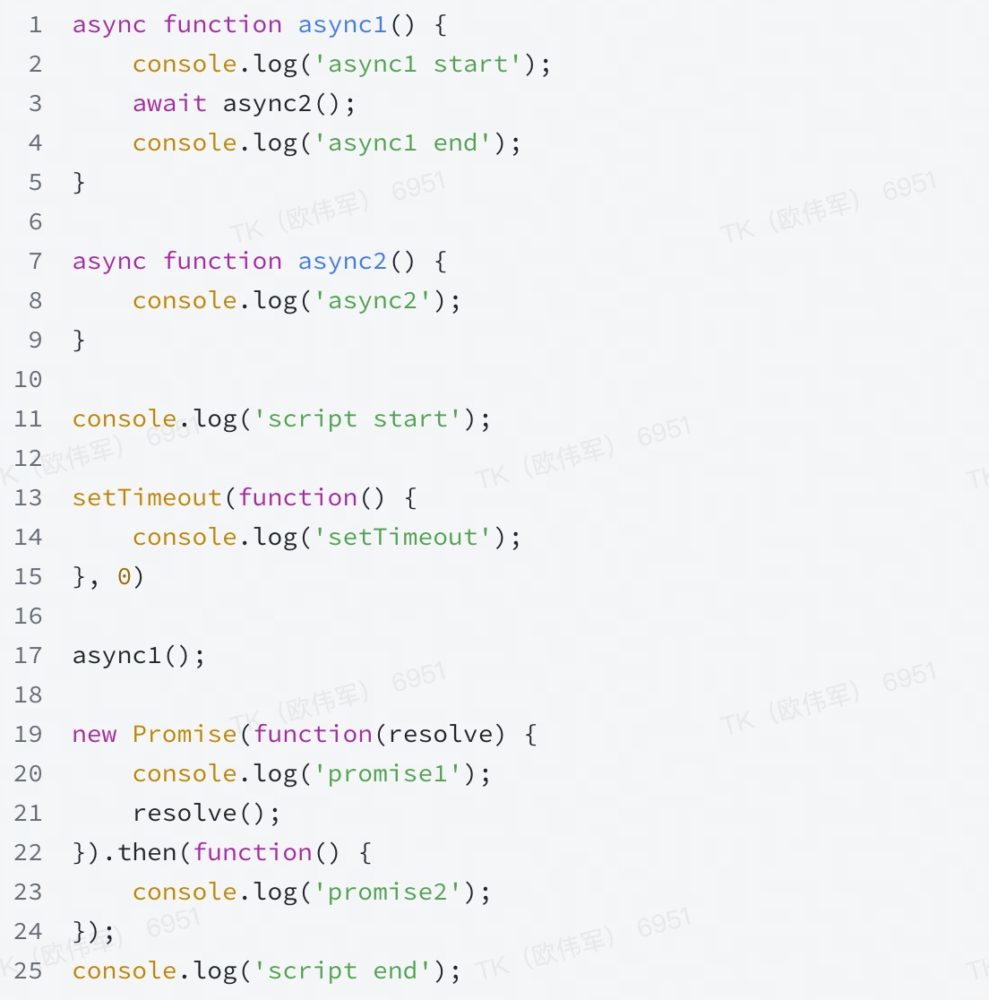

### 工程化

jenkins的自动化构建

那你是怎么做的， 为什么要定时构建， 为什么不提交代码的时候去构建


Webpack常用的plugins，loader和plugins的区别

Webpack的一个执行过程


### 浏览器的缓存

说说强缓存和协商缓存，他们的区别

### Vue、React

Vue3响应式和Vue2响应式的区别？


React 会在什么时候执行更新

React Hooks 的有哪些缺点？

- 状态不同步

### typescript

`const`和`readonly`的区别

```js
const obj = { a: 'xx' }
// obj = {}
obj.a = '22' // readonly X
```


`type`和`interface`的区别

### 其他方法

最近在学习什么、为什么打算辞职

### 题目、算法

看打印结果



N步楼梯， 可以一次走两步，可以一次走一步， 请问共有多少种走法


```js
'[](){}' // true
'[()]' // true
'{[})' // false	
```

